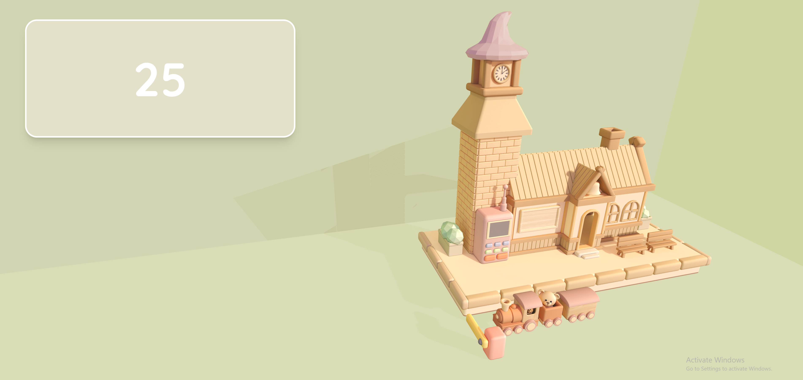
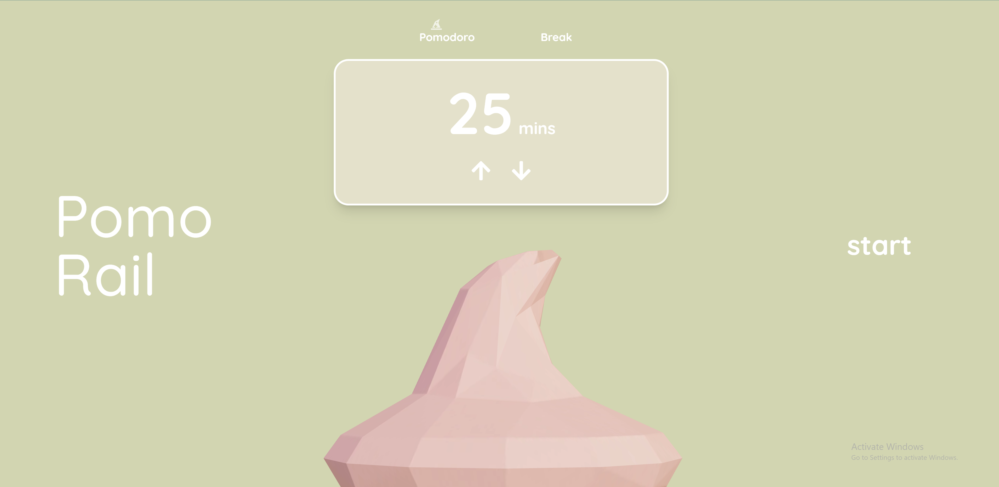
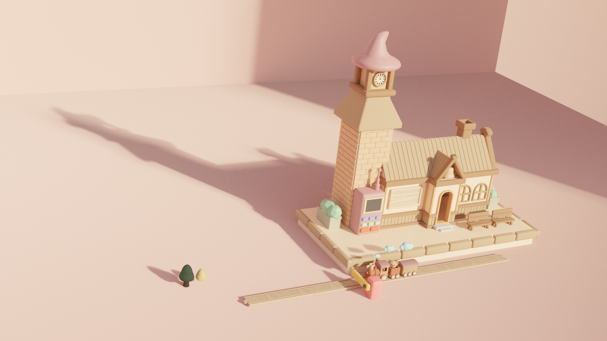
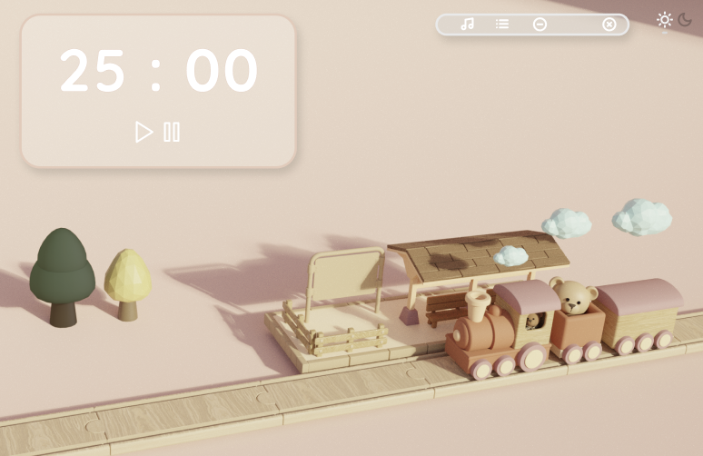

# Pomodoro Train Station ⏰🚂
A 3D productivity app built with **Three.js** and **React**. (In Progress)  
Stay focused with a relaxing train journey that follows your Pomodoro sessions.  

---

## ⚠️ Project Status
This project is currently **under development**.  
The core 3D models are complete and basic scenes are working, with timer and backend features planned.  

---

## 🎥 Preview

### Blender renders:

---

## ✨ Features

### ✅ Implemented
- Custom 3D models of train + station (created in Blender).
- Title page scene with basic UI.
- Train station and train rendered in Three.js.
- React + Tailwind integration for layout and styling.

### 🚧 Planned
- Pomodoro timer with start/pause/reset.
- Animated train loops that sync with session time.
- Backend integration (Node.js + MongoDB) for saving sessions & streaks.
- Multiplayer “study with friends” mode.
- Extra themes (day/night, cherry blossom, winter).

---

## 🛠 Tech Stack
- [Three.js](https://threejs.org/) – 3D rendering  
- [React](https://reactjs.org/) + [Vite](https://vitejs.dev/) – frontend framework  
- [TailwindCSS](https://tailwindcss.com/) – styling  
- [Blender](https://www.blender.org/) – 3D model design  
- Planned: **Node.js** (Express) + **MongoDB** – backend & persiste
